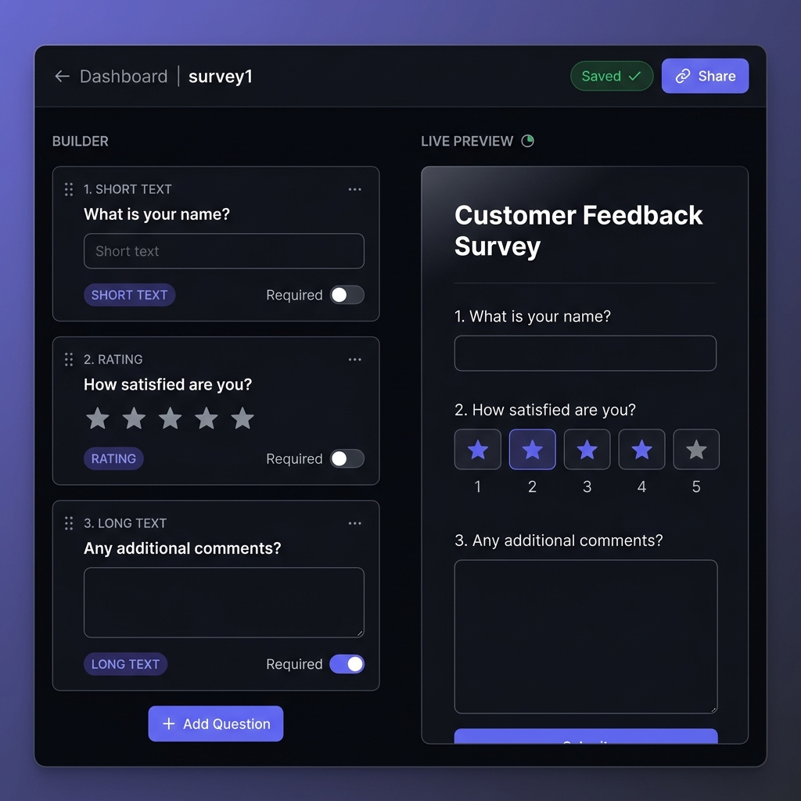

<div align="center">



# 📋 Survey-Builders

**A professional branded survey builder — create, share & analyse responses in minutes.**

[](https://docodeago-survey-builder.pages.dev)
[](https://docodeago-survey-builder.pages.dev)
[](https://www.typescriptlang.org/)

</div>

---

## 🌐 Live URLs

| Service | URL |
|---|---|
| **Frontend (Cloudflare Pages)** | https://docodeago-survey-builder.pages.dev |
| **API (Cloudflare Workers)** | https://docodeago-survey-builder-api.prasaddongapure7660.workers.dev |

---

## ✨ Features

### ✅ MVP (all shipped)

| Feature | Details |
|---|---|
| **Smart Authentication** | Magic link (Brevo email) + password login. New users → magic link → set password. Returning users → email + password |
| **Survey Builder** | Drag-and-drop question reordering, real-time live preview side-by-side |
| **4 Question Types** | Short text · Long text · Multiple choice · Rating (1–5) |
| **Per-survey Branding** | Custom primary color picker + logo URL — applied instantly to public survey |
| **Shareable Public URL** | `/s/:id` — rendered in owner's brand, **no login required** to respond |
| **Anonymous Responses** | Submitted and persisted server-side (Cloudflare D1) |
| **Owner Dashboard** | List all surveys with response count, edit / share / delete |
| **Response Analytics** | Bar charts (multiple choice), star histogram (rating), sample quotes (text) |

### 🚀 Stretch Goals (also shipped)

- 📊 **Response analytics** — per-question breakdowns with visual charts
- ⬇️ **CSV export** — one-click download of all responses
- 📝 **Long text question type** — paragraph textarea answers
- ☁️ **Deployed to Cloudflare** — Pages (frontend) + Workers (API) + D1 (DB)

---

## 🔐 Authentication Flow

```
New user:
  Enter email → check → Magic link sent (Brevo) → Click link
  → "Set a password for next time" (or skip) → Dashboard

Returning user (with password):
  Enter email → Password field → Sign in instantly

Returning user (no password yet):
  Enter email → "Send magic link" → Click link → Dashboard
  → Can set password from the link-in link prompt
```

- **Passwords**: Hashed with PBKDF2 via WebCrypto API (zero external deps, works natively in Cloudflare Workers)
- **Sessions**: 30-day `SameSite=None; Secure` cookies (cross-origin: Pages ↔ Workers)
- **Magic links**: Delivered via Brevo (300 emails/day free, any recipient)

---

## 🏗️ Architecture

```
┌─────────────────────────────────────────────────────┐
│  Cloudflare Pages (docodeago-survey-builder)        │
│  React 18 + Vite + TanStack Router + TypeScript     │
│  Drag-and-drop: @dnd-kit                            │
└──────────────────────┬──────────────────────────────┘
                       │ HTTPS + SameSite=None cookie
┌──────────────────────▼──────────────────────────────┐
│  Cloudflare Workers (docodeago-survey-builder-api)  │
│  Hono v4 · Zod validation · TypeScript              │
│  Auth: Magic links + PBKDF2 password hashing        │
│  Email: Brevo API (fallback: Resend)                │
└──────────────────────┬──────────────────────────────┘
                       │
       ┌───────────────┴───────────────┐
       │                               │
┌──────▼───────┐              ┌────────▼────────┐
│  D1 Database │              │   KV (Sessions) │
│  (SQLite)    │              │                 │
│  users       │              │  session tokens │
│  surveys     │              └─────────────────┘
│  questions   │
│  responses   │
│  magic_links │
└──────────────┘
```

---

## 🗂️ Project Structure

```
docodeago-survey-builder/
├── api/                          # Cloudflare Worker (Hono API)
│   └── src/
│       ├── index.ts              # Entry, CORS, routing
│       ├── types.ts              # Bindings, AppEnv
│       ├── lib/
│       │   ├── crypto.ts         # PBKDF2 password hashing
│       │   ├── db.ts             # D1 database helpers
│       │   ├── email.ts          # Brevo + Resend email
│       │   └── id.ts             # NanoID generator
│       └── routes/
│           ├── auth.ts           # check-email, login, magic-link, verify, set-password
│           ├── surveys.ts        # CRUD surveys + questions
│           ├── responses.ts      # List responses
│           └── public.ts         # Public survey + anonymous submit
│
├── web/                          # React SPA (Cloudflare Pages)
│   └── src/
│       ├── pages/
│       │   ├── LoginPage.tsx     # 3-step smart auth flow
│       │   ├── VerifyPage.tsx    # Magic link verify + set password
│       │   ├── DashboardPage.tsx # Survey list + management
│       │   ├── BuilderPage.tsx   # Drag-drop survey editor
│       │   ├── ResponsesPage.tsx # Analytics + table + CSV export
│       │   └── PublicSurveyPage.tsx # Branded public survey
│       ├── components/
│       │   ├── builder/          # BrandPanel, QuestionCard, SurveyPreview
│       │   └── questions/        # ShortText, LongText, MultipleChoice, Rating
│       ├── api.ts                # Typed API client
│       ├── types.ts              # Shared TypeScript types
│       └── index.css             # Design system (dark theme, glassmorphism)
│
├── wrangler.jsonc                # Cloudflare Worker config
└── pnpm-workspace.yaml           # Monorepo config
```

---

## 🚀 Local Development

### Prerequisites
- Node.js ≥ 18
- pnpm ≥ 9
- Cloudflare account (for D1 + Workers)

### 1. Clone & install

```bash
git clone https://github.com/Shivprasadpravindongapure/docodeago-survey-builder.git
cd docodeago-survey-builder
pnpm install
```

### 2. Create D1 database

```bash
cd api
npx wrangler d1 create survey-builder-db
# Update the database_id in wrangler.jsonc
npx wrangler d1 execute survey-builder-db --local --file=migrations/001_init.sql
```

### 3. Set secrets (local dev — use .dev.vars)

```bash
# api/.dev.vars
BREVO_API_KEY=your_brevo_key
RESEND_API_KEY=your_resend_key
GEMINI_API_KEY=your_gemini_key
```

### 4. Start dev servers

```bash
# Terminal 1: API (Hono on Workers runtime)
cd api && npx wrangler dev

# Terminal 2: Frontend (Vite)
cd web && VITE_API_BASE_URL=http://localhost:8787 pnpm dev
```

Open http://localhost:5173

---

## 📦 Deploy to Cloudflare

```bash
# 1. Deploy API Worker
cd api
npx wrangler deploy src/index.ts

# 2. Upload secrets
npx wrangler secret put BREVO_API_KEY
npx wrangler secret put RESEND_API_KEY
npx wrangler secret put GEMINI_API_KEY

# 3. Build & deploy frontend
cd ../web
VITE_API_BASE_URL=https://your-worker.workers.dev pnpm build
npx wrangler pages deploy dist --project-name=your-project-name
```

---

## 🛠️ Tech Stack

| Layer | Technology |
|---|---|
| **Frontend** | React 18, TypeScript, Vite, TanStack Router |
| **Drag & Drop** | @dnd-kit/core + @dnd-kit/sortable |
| **Backend** | Hono v4 on Cloudflare Workers |
| **Validation** | Zod + @hono/zod-validator |
| **Database** | Cloudflare D1 (SQLite at the edge) |
| **Sessions** | Cloudflare KV + SameSite=None cookies |
| **Email** | Brevo API (primary) · Resend (fallback) |
| **Password hashing** | PBKDF2-SHA256 via WebCrypto (100k iterations) |
| **Deployment** | Cloudflare Pages (frontend) + Workers (API) |
| **Package manager** | pnpm workspaces (monorepo) |

---

## 📊 Database Schema

```sql
CREATE TABLE users (
  id TEXT PRIMARY KEY,
  email TEXT UNIQUE NOT NULL,
  name TEXT,
  password_hash TEXT,          -- PBKDF2 hash, NULL if magic-link-only
  created_at TEXT NOT NULL
);

CREATE TABLE sessions (
  token TEXT PRIMARY KEY,
  user_id TEXT NOT NULL,
  expires_at TEXT NOT NULL,
  FOREIGN KEY (user_id) REFERENCES users(id) ON DELETE CASCADE
);

CREATE TABLE magic_links (
  token TEXT PRIMARY KEY,
  email TEXT NOT NULL,
  expires_at TEXT NOT NULL,
  used INTEGER NOT NULL DEFAULT 0,
  created_at TEXT NOT NULL
);

CREATE TABLE surveys (
  id TEXT PRIMARY KEY,
  user_id TEXT NOT NULL,
  title TEXT NOT NULL,
  description TEXT,
  brand_color TEXT NOT NULL DEFAULT '#6366f1',
  logo_url TEXT,
  is_published INTEGER NOT NULL DEFAULT 0,
  created_at TEXT NOT NULL,
  updated_at TEXT NOT NULL,
  FOREIGN KEY (user_id) REFERENCES users(id) ON DELETE CASCADE
);

CREATE TABLE questions (
  id TEXT PRIMARY KEY,
  survey_id TEXT NOT NULL,
  type TEXT NOT NULL,          -- short_text | long_text | multiple_choice | rating
  label TEXT NOT NULL,
  options TEXT,                -- JSON array for multiple_choice
  position INTEGER NOT NULL,
  required INTEGER NOT NULL DEFAULT 0,
  created_at TEXT NOT NULL,
  FOREIGN KEY (survey_id) REFERENCES surveys(id) ON DELETE CASCADE
);

CREATE TABLE responses (
  id TEXT PRIMARY KEY,
  survey_id TEXT NOT NULL,
  submitted_at TEXT NOT NULL,
  FOREIGN KEY (survey_id) REFERENCES surveys(id) ON DELETE CASCADE
);

CREATE TABLE response_answers (
  id TEXT PRIMARY KEY,
  response_id TEXT NOT NULL,
  question_id TEXT NOT NULL,
  value TEXT NOT NULL,
  FOREIGN KEY (response_id) REFERENCES responses(id) ON DELETE CASCADE
);
```

---

## 📸 Screenshots

### Survey Builder
> Drag-and-drop editor with live preview, brand color, and logo settings


---

## 📄 License

MIT — feel free to fork and build on this!

---

<div align="center">
  <strong>Built with ❤️ on Cloudflare — <a href="https://docodeago-survey-builder.pages.dev">Try it live →</a></strong>
</div>
